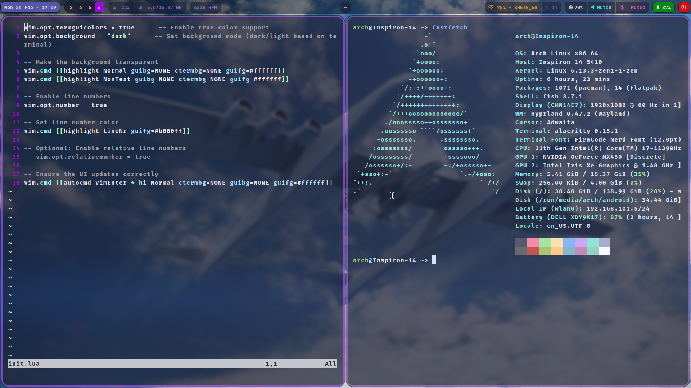

# 🌿 My Custom Hyprland Configuration

This repository contains my personalized **Hyprland** and **Waybar** configuration, designed for a clean, minimal, and efficient workflow. The setup includes custom keybindings, themes, and tweaks for a seamless Wayland experience.

## 📌 Features

- **Custom Hyprland setup** with optimized window management
- **Waybar configuration** for an aesthetic and functional status bar
- **Minimalist design** with performance-oriented tweaks
- **Hyprconfig inspired by **[**mylinuxforwork**](https://github.com/mylinuxforwork)**'s configuration**
- **Enhanced usability** with custom keybindings and scripts

## 📂 Installation

### 1️⃣ Clone the repository

```bash
mkdir -p ~/.config/hypr
cd ~/.config/hypr
git clone https://github.com/shetesumedh/hyprland_1.0 .
```

### 2️⃣ Install dependencies (if needed)

Ensure you have Hyprland and Waybar installed:

```bash
sudo pacman -Syu
sudo pacman -S hyprland waybar alacritty ttf-jetbrains-mono
```

### 3️⃣ Restart Hyprland

Log out and log back in to apply changes.

## 🔧 Customization

Feel free to modify the configuration files to suit your workflow. Key config files:

- `hyprland.conf` - Main Hyprland configuration
- `waybar/config.jsonc` - Waybar layout
- `waybar/style.css` - Waybar theme

## 📸 Screenshots





## 🎥 Demo


❤️ Support This Project

If you find this repository useful and would like to support further development, you can donate using the following cryptocurrency addresses:

Bitcoin (BTC): bc1q93ln57zwawyf54ednympwpntmw4z92emcddwcz

Ethereum (ETH): 0x98339Cd05D42E22c88080689E6d6b0429a1b386C

Solana (SOL): CNWie8g2fM8cTRRk4axqxt42shZBkuqHe5YJC7tSpB95

I’d love to hear your feedback! Let me know if you try it out or have suggestions for improvement. 😊🚀

## Contact

https://www.linkedin.com/in/sumedh-shete-bb7854232/

